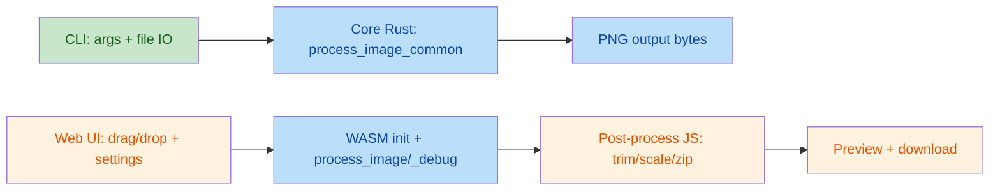
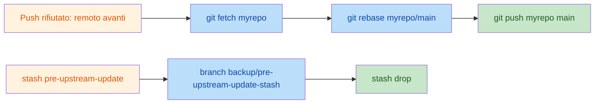

# Revisione Dettagliata Progetto CLI e GUI

> **Workspace:** c:\_Works\PixelSnapper\spritefusion-pixel-snapper

---

**User**

mi fai un controllo del progetto dato che l'ho riaperto con un nuovo account TRAE ora non ho tutto lo storico delle chat. mi devi rivedere tutto il progetto in generale in modo da poter riprendere e lavorare sul progetto sia la versione CLI che la versione GUI .. quindi fai un refresh dettagliato di tutto il progetto

**Assistant**

**Panoramica (dove sei rimasto)**
- Il progetto è un unico crate Rust che espone:
  - **Core algorithm** (Rust) come libreria + WASM: [main.rs](file:///c:/_Works/PixelSnapper/spritefusion-pixel-snapper/src/main.rs)
  - **CLI nativa** (Rust): [nasty-retropixel-cli.rs](file:///c:/_Works/PixelSnapper/spritefusion-pixel-snapper/src/bin/nasty-retropixel-cli.rs)
  - **GUI Web locale** (HTML/JS) che chiama il WASM: [index.html](file:///c:/_Works/PixelSnapper/spritefusion-pixel-snapper/web/index.html), [main.js](file:///c:/_Works/PixelSnapper/spritefusion-pixel-snapper/web/main.js)
- Build “GUI” = **WASM + server statico** (python http.server) tramite script PowerShell: [build-web.ps1](file:///c:/_Works/PixelSnapper/spritefusion-pixel-snapper/scripts/build-web.ps1), [dev-web.ps1](file:///c:/_Works/PixelSnapper/spritefusion-pixel-snapper/scripts/dev-web.ps1)



**Struttura repository (mappa veloce)**
- Config/build crate: [Cargo.toml](file:///c:/_Works/PixelSnapper/spritefusion-pixel-snapper/Cargo.toml)
  - `crate-type = ["cdylib","rlib"]` per WASM + libreria nativa
  - bin dedicato CLI: `nasty-retropixel-cli`
- Core algorithm: [src/main.rs](file:///c:/_Works/PixelSnapper/spritefusion-pixel-snapper/src/main.rs)
- CLI wrapper: [src/bin/nasty-retropixel-cli.rs](file:///c:/_Works/PixelSnapper/spritefusion-pixel-snapper/src/bin/nasty-retropixel-cli.rs)
- Web GUI statica: [web/](file:///c:/_Works/PixelSnapper/spritefusion-pixel-snapper/web)
- Asset statici README: [static/](file:///c:/_Works/PixelSnapper/spritefusion-pixel-snapper/static)
- Script web: [scripts/](file:///c:/_Works/PixelSnapper/spritefusion-pixel-snapper/scripts)

**CLI (come funziona oggi)**
- Entry point: [nasty-retropixel-cli.rs](file:///c:/_Works/PixelSnapper/spritefusion-pixel-snapper/src/bin/nasty-retropixel-cli.rs)
- Parsing argomenti supportati:
  - `k_colors` posizionale (opzionale)
  - `--pixel-size <n>`
  - `--denoise off|box3` → `prefilter_mode` (0/1)
  - `--palette-source pixels|cells` → `palette_source` (0/1)
  - `--dither off|fs` → `dither_mode` (0/1)
  - `--color-space srgb|linear` → `color_space` (0/1)
- Chiamata al core: `process_image_bytes_with_config(...)` (libreria) per ottenere PNG bytes e scriverli su output.

Nota importante di allineamento: nel core esiste batch-processing nativo (`process_batch_with_reporter`, ecc.) in [main.rs:L120-694](file:///c:/_Works/PixelSnapper/spritefusion-pixel-snapper/src/main.rs#L120-L694), ma **la CLI attuale non lo espone** (oggi legge sempre un file singolo).

**Web GUI (come funziona)**
- UI: [index.html](file:///c:/_Works/PixelSnapper/spritefusion-pixel-snapper/web/index.html) (drawer opzioni, batch mode, compare slider, overlay griglia)
- Logica: [main.js](file:///c:/_Works/PixelSnapper/spritefusion-pixel-snapper/web/main.js)
  - `init()` carica il modulo wasm-bindgen: `web/pkg/nasty_retropixel.js` (generato)
  - processamento:
    - `process_image(...)` per output standard: [main.js:L621-L647](file:///c:/_Works/PixelSnapper/spritefusion-pixel-snapper/web/main.js#L621-L647)
    - `process_image_debug(...)` quando vuoi overlay griglia: [main.js:L649-L690](file:///c:/_Works/PixelSnapper/spritefusion-pixel-snapper/web/main.js#L649-L690)
  - post-processing JS sull’output PNG:
    - trim trasparenza + scaling nearest: [main.js:L481-L547](file:///c:/_Works/PixelSnapper/spritefusion-pixel-snapper/web/main.js#L481-L547)
  - batch:
    - processa in loop e prepara download singoli oppure ZIP “store” (offline, senza dipendenze): [main.js:L1031-L1076](file:///c:/_Works/PixelSnapper/spritefusion-pixel-snapper/web/main.js#L1031-L1076)

**Core algorithm (pipeline tecnica)**
- Entry “comune” (sia CLI che WASM) passa da: [main.rs:L206-L312](file:///c:/_Works/PixelSnapper/spritefusion-pixel-snapper/src/main.rs#L206-L312)
- Pipeline:
  1) Decode immagine da bytes + validate dimensioni: [main.rs:L225-L239](file:///c:/_Works/PixelSnapper/spritefusion-pixel-snapper/src/main.rs#L225-L239), [main.rs:L791-L803](file:///c:/_Works/PixelSnapper/spritefusion-pixel-snapper/src/main.rs#L791-L803)
  2) Prefilter opzionale (denoise box3 alpha-aware): [main.rs:L240-L245](file:///c:/_Works/PixelSnapper/spritefusion-pixel-snapper/src/main.rs#L240-L245), [main.rs:L1474-L1520](file:///c:/_Works/PixelSnapper/spritefusion-pixel-snapper/src/main.rs#L1474-L1520)
  3) Profilazione griglia:
     - quantizzazione “per profiling” (k clamp 16..64): [main.rs:L247-L252](file:///c:/_Works/PixelSnapper/spritefusion-pixel-snapper/src/main.rs#L247-L252)
     - gradient profiles X/Y: [main.rs:L981-L1021](file:///c:/_Works/PixelSnapper/spritefusion-pixel-snapper/src/main.rs#L981-L1021)
  4) Stima pixel size (peaks → fallback autocorr) + fix incoerenze tra assi: [main.rs:L1023-L1137](file:///c:/_Works/PixelSnapper/spritefusion-pixel-snapper/src/main.rs#L1023-L1137)
  5) “Walker” per trovare i tagli (cuts) + stabilizzazione/correzione skew: [main.rs:L1212-L1417](file:///c:/_Works/PixelSnapper/spritefusion-pixel-snapper/src/main.rs#L1212-L1417)
  6) Resampling:
     - `palette_source=cells` → media per cella + palette kmeans + dithering opzionale: [main.rs:L1629-L1792](file:///c:/_Works/PixelSnapper/spritefusion-pixel-snapper/src/main.rs#L1629-L1792)
     - `palette_source=pixels` → quantize immagine intera + mode per cella: [main.rs:L288-L294](file:///c:/_Works/PixelSnapper/spritefusion-pixel-snapper/src/main.rs#L288-L294), [main.rs:L841-L979](file:///c:/_Works/PixelSnapper/spritefusion-pixel-snapper/src/main.rs#L841-L979), [main.rs:L1419-L1472](file:///c:/_Works/PixelSnapper/spritefusion-pixel-snapper/src/main.rs#L1419-L1472)
  7) Encode PNG e ritorno bytes: [main.rs:L296-L312](file:///c:/_Works/PixelSnapper/spritefusion-pixel-snapper/src/main.rs#L296-L312)

```mermaid
flowchart TB
  classDef opt fill:#f3e5f5,color:#7b1fa2
  classDef core fill:#bbdefb,color:#0d47a1
  classDef io fill:#c8e6c9,color:#1a5e20

  I[Input bytes]:::io --> D[Decode to RGBA]:::core --> V[Validate dims]:::core
  V --> P{Prefilter?}:::opt
  P -->|off| Q[Quantize for profiling]:::core
  P -->|box3| F[Box3 alpha-aware]:::core --> Q
  Q --> PR[Compute gradient profiles X/Y]:::core
  PR --> ES[Estimate step size (peaks/autocorr)]:::core
  ES --> W[Walker cuts]:::core --> S[Stabilize cuts]:::core
  S --> R{Palette source}:::opt
  R -->|cells| RC[Resample cells + palette kmeans + optional dithering]:::core
  R -->|pixels| RP[Quantize pixels + mode per cell]:::core
  RC --> O[Encode PNG bytes]:::io
  RP --> O
```

**Build/Run (pronto per riprendere)**
- CLI:
  - `cargo run --bin nasty-retropixel-cli -- input.png output.png 16 --pixel-size 8 ...`
- Web:
  - `.\scripts\dev-web.ps1` → build wasm + serve `web/` su `http://localhost:8080/`
  - `.\scripts\build-web.ps1` → rigenera `web/pkg/*`

Nota ambiente TRAE: qui non ho `cargo` disponibile (risulta “cargo non riconosciuto”), quindi non posso compilare/verificare build da questa sandbox; localmente con Rust installato i comandi sopra sono quelli previsti.

**Punti di attenzione (per ripartire senza storico)**
- **Mismatch README vs CLI**: nel README c’è un esempio batch `cargo run -- input_dir output_dir 16` ma con `autobins=false` e con la CLI attuale che non gestisce directory, è facile che sia fuori sync con lo stato corrente del codice (batch esiste nel core, non nella CLI).
- **Performance hotspot**: la quantizzazione/kmeans è implementata “in casa” e fa loop intensivi; su immagini grandi può pesare (comunque coerente con gli obiettivi).
- **Separazione responsabilità**: trimming/scaling/zip sono solo nel Web (JS), non nel core Rust: se vuoi feature identiche in CLI, vanno portate lì.

Se mi dici qual è il prossimo obiettivo concreto (es. “allineare CLI al batch del core” oppure “aggiungere in CLI trim/scaling come nel web”, oppure “aggiungere output debug anche in CLI”), parto direttamente con le modifiche.

---

**User**

ti ho aggiunto lo storico così ti puoi aggiornare ..  quindi aggiornati e dimmi quando sei pronto `c:\_Works\PixelSnapper\spritefusion-pixel-snapper\Aggiorna Progetto Rust da Repository.md`

**Assistant**

Ho letto e assorbito lo storico in [Aggiorna Progetto Rust da Repository.md](file:///c:/_Works/PixelSnapper/spritefusion-pixel-snapper/Aggiorna%20Progetto%20Rust%20da%20Repository.md) e sono aggiornato.

- Contesto: in passato avete fatto update da `Hugo-Dz/spritefusion-pixel-snapper` fino alle commit `45c4a66` (batch), `16502a4` (lifecycle events), `5c20a0f` (readme/assets), cercando di mantenere le vostre custom (rebrand “Nasty RetroPixel”, CLI avanzata, API WASM + `process_image_debug`, web GUI, script build/run).
- Punto rimasto aperto nello storico: “allineare tutto” senza perdere custom, con attenzione a cosa è già nel working tree vs cosa è ancora nello stash, e assicurarsi che il progetto comunichi chiaramente che va oltre lo snap standard (grid recovery + palette + denoise + batch).

Dimmi pure su cosa vuoi che parta adesso (allineamento finale + ripristino custom + verifica build/run CLI e Web) e procedo.

---

**User**

si procedi con tutto .. fammi un controllo generico in modo da avere tutto allineato e quindi poter effettuare migliorie e nuove feature che tu mi proporrai per rendere il software migliore dell'originale

**User**

che succede?

**Assistant**

Che succedeva: il push su `myrepo/main` era stato rifiutato perché sul remoto c’erano commit più recenti (“fetch first”). Ho risolto facendo `fetch` + `rebase` su `myrepo/main` e poi `push` (ora è tutto sincronizzato).

**Stato attuale (allineamento)**
- Branch: `main` è pulito e allineato con `myrepo/main` (`git status` pulito).
- Remoti:
  - `origin` = upstream `Hugo-Dz/spritefusion-pixel-snapper`
  - `myrepo` = il tuo fork `lordnasty/nasty-retropixel`
- Stash: quello storico `pre-upstream-update` non è più nello stash, ma è stato preservato in un branch di backup `backup/pre-upstream-update-stash` (quindi non si perde nulla).



**Fix di allineamento applicati**
- CLI ora supporta davvero il batch quando `input` è una directory (agganciandosi al batch engine del core): [nasty-retropixel-cli.rs:L161-L231](file:///c:/_Works/PixelSnapper/spritefusion-pixel-snapper/src/bin/nasty-retropixel-cli.rs#L161-L231)
- CLI ora gestisce anche `output` come directory nel caso single-file (scrive `<stem>.png` dentro la cartella): [nasty-retropixel-cli.rs:L233-L245](file:///c:/_Works/PixelSnapper/spritefusion-pixel-snapper/src/bin/nasty-retropixel-cli.rs#L233-L245)
- `Aggiorna Progetto Rust da Repository.md` viene ignorato da Git per non sporcare lo status: [.gitignore](file:///c:/_Works/PixelSnapper/spritefusion-pixel-snapper/.gitignore)
- README: comando batch corretto (serve `--bin nasty-retropixel-cli`): [README.md:L67-L71](file:///c:/_Works/PixelSnapper/spritefusion-pixel-snapper/README.md#L67-L71)

**Come testare adesso (Windows)**
- CLI single:
  - `cargo run --bin nasty-retropixel-cli -- static\\hero.png out_test.png 16 --pixel-size 8 --denoise box3 --palette-source cells --dither off --color-space linear`
- CLI batch:
  - `cargo run --bin nasty-retropixel-cli -- input_dir output_dir 16 --denoise box3 --palette-source cells`
- GUI Web/WASM:
  - `.\scripts\dev-web.ps1` e poi apri `http://localhost:8080/`

Nota ambiente TRAE: qui `cargo/rustc` non sono nel PATH della sandbox, quindi non posso compilare da questo terminale; sul tuo PC invece i comandi sopra sono quelli corretti.

**Migliorie (oltre l’originale) che ti propongo**
- Output “debug pack” per batch: oltre al PNG finale, esportare JSON con `pixel_size`, `col_cuts/row_cuts`, palette, e un PNG overlay opzionale (utile per validare grid recovery).
- Batch “preserva struttura”: input dir ricorsiva e output che replica le sottocartelle (oggi il batch appiattisce a `stem.png`).
- Modalità “palette lock”: usare una palette di riferimento (file `.png`/`.hex`) per vincolare la quantizzazione, oltre al k-means.
- UI: slider per “aggressività” grid recovery + preview differenza palette (prima/dopo) e indicatore “pixel size stimato” sempre visibile.

Se vuoi, il prossimo step lo faccio direttamente così: aggiungo in core una modalità export debug (PNG overlay + JSON) e la aggancio sia a CLI (batch compreso) sia alla Web UI.

---

